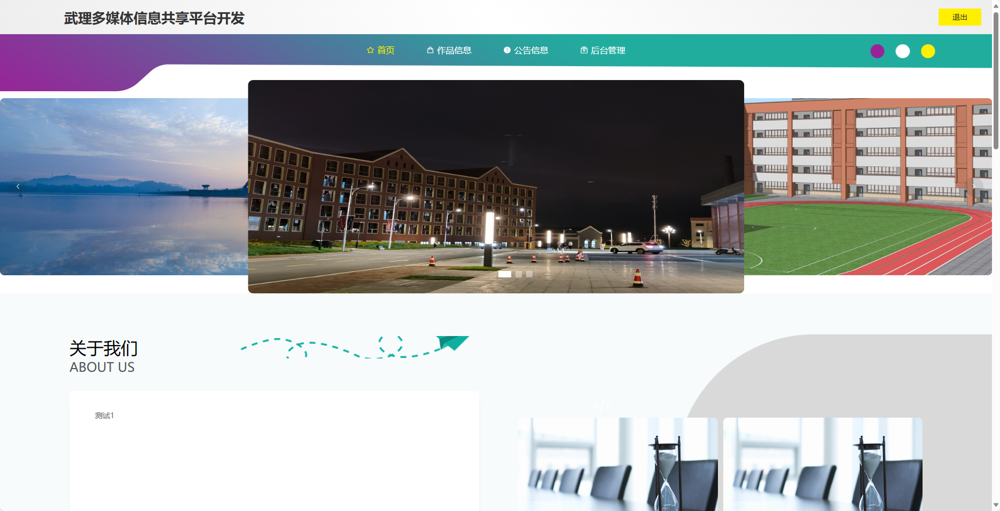
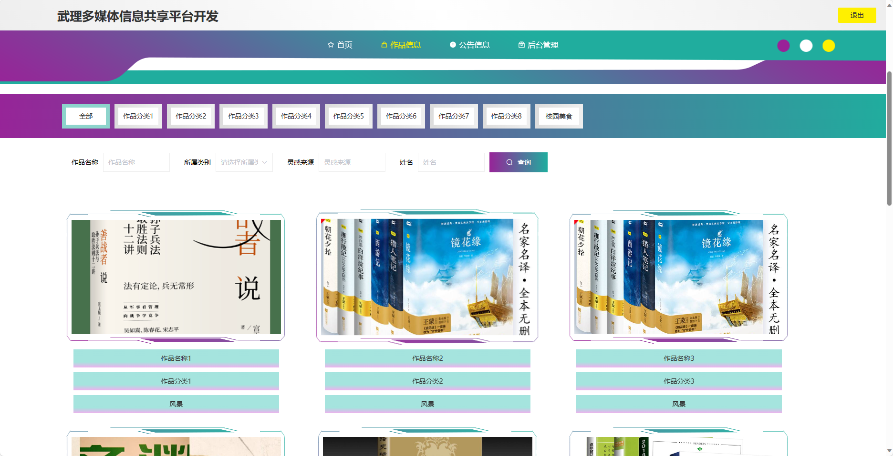
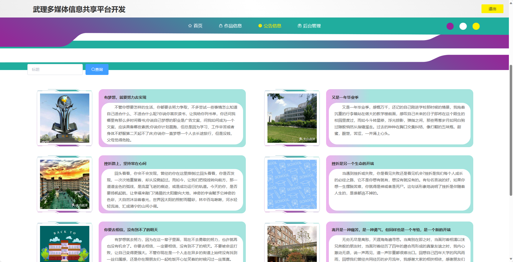
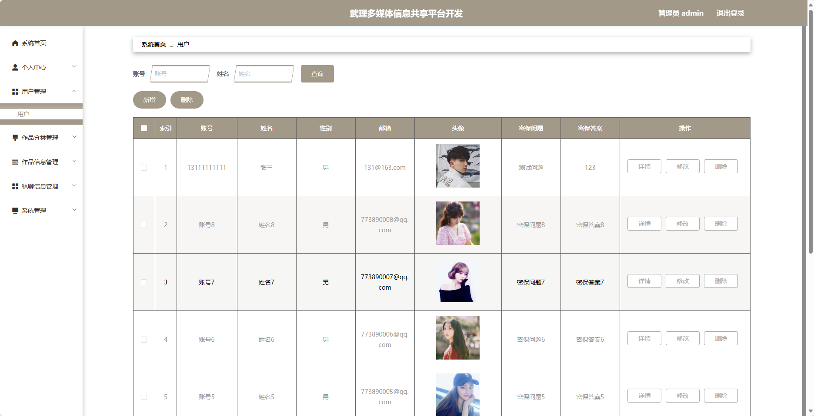
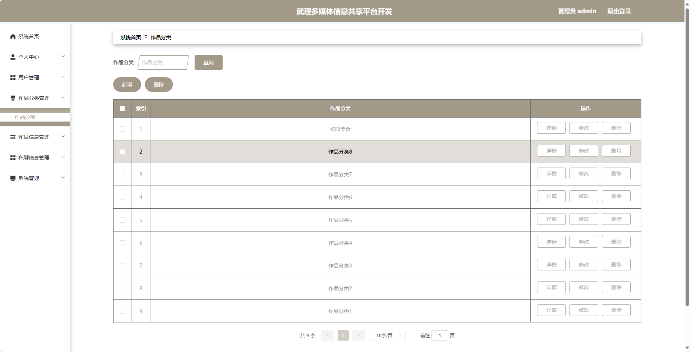
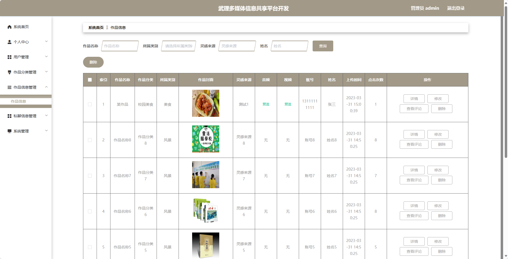
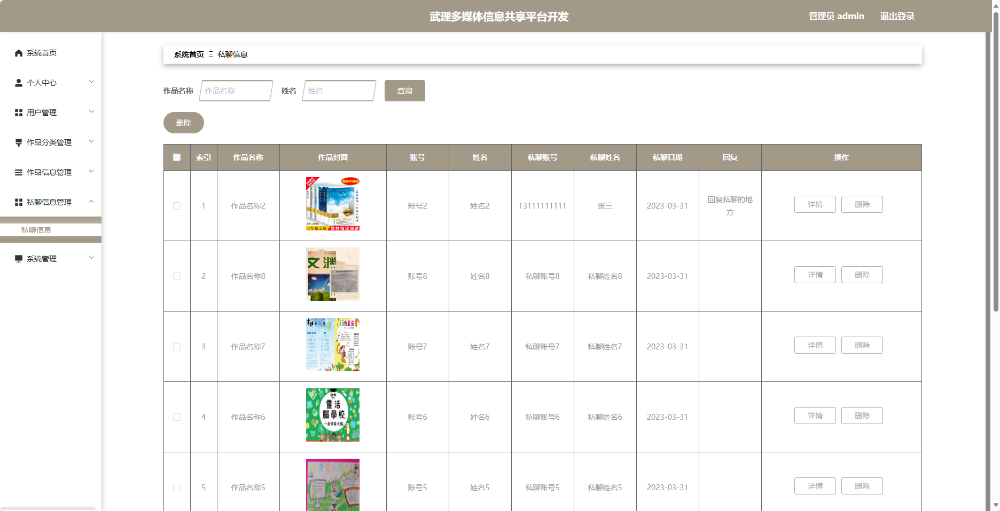
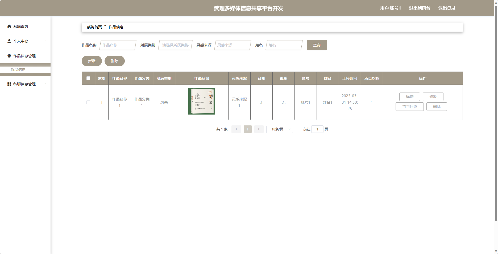
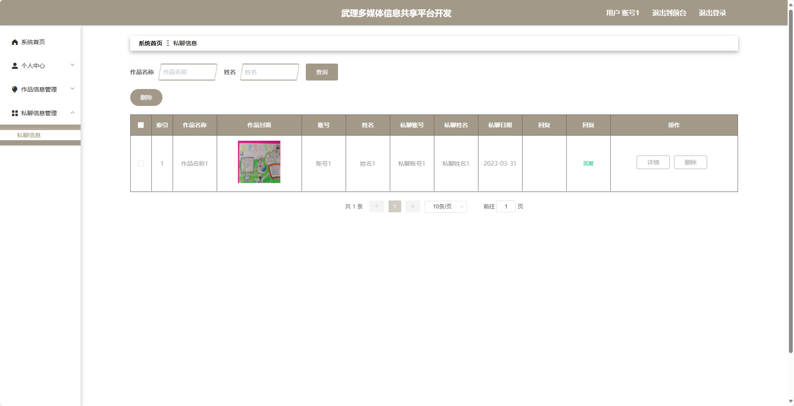

基于SpringBoot的武理多媒体信息共享平台
=
- 完整代码获取地址：从戎源码网 ([https://armycodes.com/](https://armycodes.com/))
- 作者微信：19941326836  QQ：952045282 
- 承接计算机毕业设计、Java毕业设计、Python毕业设计、深度学习、机器学习
- 选题+开题报告+任务书+程序定制+安装调试+论文+答辩ppt 一条龙服务
- 所有选题地址https://github.com/nature924/allProject

一、项目介绍
---
基于Spring Boot框架实现的武理多媒体信息共享平台，系统包含两种角色：管理员、用户,系统分为前台和后台两大模块，主要功能如下。

### 前台：
- 首页：展示平台的概览信息。
- 作品信息：展示多媒体作品的详细信息。
- 公告信息：提供平台相关的通知公告、活动安排等。

### 后台：
### 管理员角色：
- 个人中心：管理员可以管理个人信息，修改密码等。
- 用户管理：管理员可以对用户的信息进行增删改查等操作。
- 作品分类管理：管理员可以管理作品的分类信息，添加、修改、删除分类名称及其描述。
- 作品信息管理：管理员可以管理作品的基本信息。
- 私聊信息管理：管理员可以管理用户之间的私聊信息。
- 系统管理：管理员可以管理系统的一些通用配置。

### 用户角色：
- 个人中心：用户可以管理个人信息，修改密码等。
- 作品信息管理：用户可以上传、管理自己的多媒体作品。
- 私聊信息管理：用户可以管理自己的私聊信息。

二、项目技术
---
- 编程语言：Java
- 数据库：MySQL
- 项目管理工具：Maven
- 前端技术：VUE、HTML、Jquery、Bootstrap
- 后端技术：Spring、SpringMVC、MyBatis

三、运行环境
---
- 操作系统：Windows、macOS都可以
- JDK版本：JDK1.8以上都可以
- 开发工具：IDEA、Ecplise、Myecplise都可以
- 数据库: MySQL5.7以上都可以
- Tomcat：任意版本都可以
- Maven：任意版本都可以

四、运行截图
---

### 程序截图：

